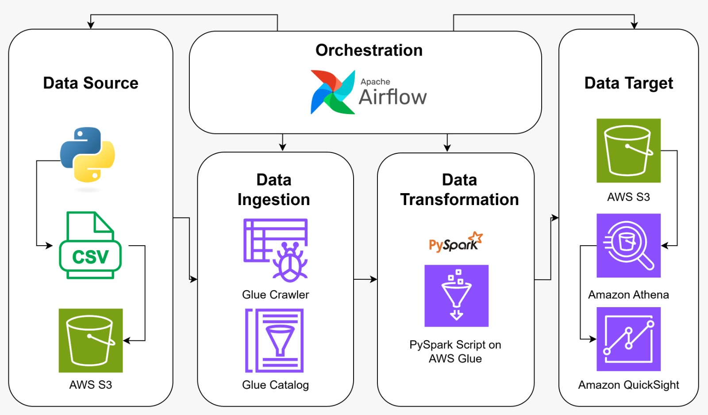

# Employee Data ETL with AWS and Apache Airflow

This repository showcases an ETL (Extract, Transform, Load) pipeline using Apache Airflow and AWS services (S3, Glue, Athena) to process employee data. The pipeline generates fake employee records, uploads them to AWS S3, runs an ETL job using AWS Glue, and queries the transformed data using AWS Athena.

## Table of Contents
- [Employee Data ETL with AWS and Apache Airflow](#employee-data-etl-with-aws-and-apache-airflow)
  - [Table of Contents](#table-of-contents)
  - [Project Overview](#project-overview)
    - [Objective:](#objective)
    - [Why This Project?](#why-this-project)
  - [Key Features](#key-features)
  - [Pipeline Workflows](#pipeline-workflows)
  - [DAG Graph](#dag-graph)
  - [Requirements](#requirements)

## Project Overview

### Objective:
To automate the processing of employee data by generating, storing, transforming, and analyzing it using AWS services and Apache Airflow.

### Why This Project?
- Demonstrates cloud-based ETL workflows with AWS.
- Automates data ingestion, transformation, and querying.
- Uses AWS Glue and Athena for scalable data processing.
- Ensures efficient orchestration with Apache Airflow.

## Key Features
1. **Automated Workflow**
   - Manages the ETL process using Apache Airflow.

2. **AWS Integration**
   - Uses **S3** for data storage.
   - Runs **AWS Glue** for data transformation.
   - Queries data with **AWS Athena**.

3. **Data Generation**
   - Utilizes Faker to generate realistic employee data.

4. **ETL Process**
   - Transforms raw data into a structured format.
   - Converts salary values to IDR.
   - Cleans phone number data.

5. **Scalability**
   - Designed for handling large datasets in the cloud.

## Pipeline Workflows

The ETL pipeline consists of the following steps:

1. **Generate Fake Employee Data**  
   - Uses `Faker` to create employee records in CSV format.

2. **Upload Data to S3**  
   - Sends raw employee data and ETL scripts to AWS S3.

3. **Delete Existing Transformed Data**  
   - Ensures only one transformed file is available for Athena queries.

4. **Wait for Data in S3**  
   - Uses an Airflow S3 sensor to confirm file availability.

5. **Run AWS Glue Crawler**  
   - Updates metadata and schema in AWS Glue.

6. **Execute AWS Glue ETL Job**  
   - Reads raw CSV data from S3.
   - Cleans and transforms data.
   - Stores the output in Parquet format in S3.

7. **Create Athena Table**  
   - Registers the transformed data in AWS Athena.

## DAG Graph

## Requirements

- **Apache Airflow**
- **AWS Services**: S3, Glue, Athena
- **Python Libraries**:
  - `apache-airflow`
  - `apache-airflow-providers-amazon`
  - `pyspark`
  - `awscli`
  - `boto3`
  - `faker`
